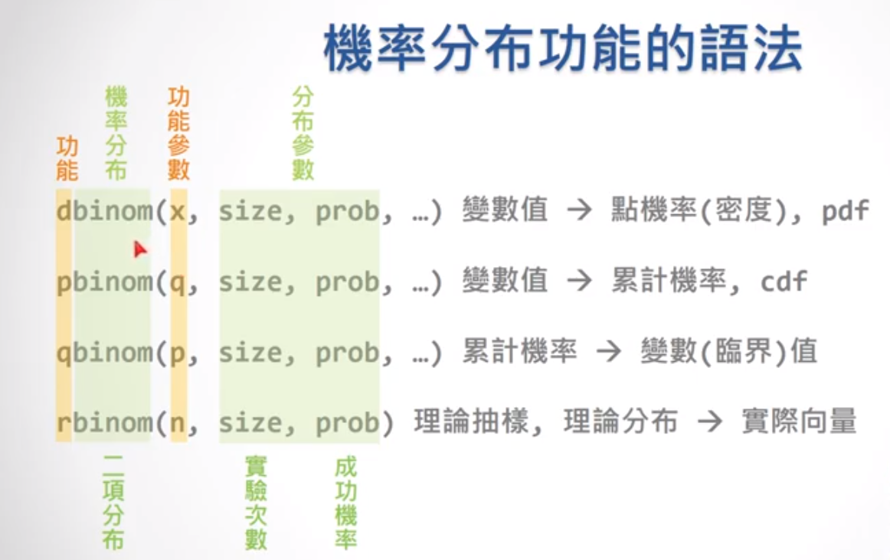
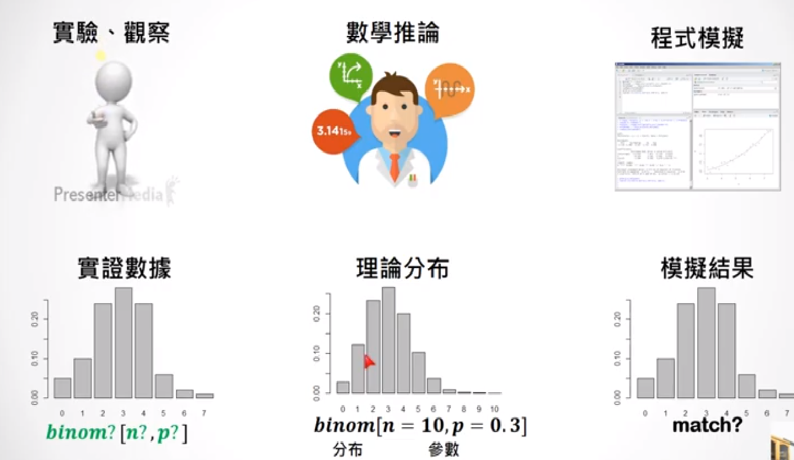

```{r}
#二項分布
#有三個變數
#前面是成功幾次，size做了幾次，還有p成功的機率是多少
library(magrittr)
library(dplyr)
par(cex=0.7)

#單值機率pdf
#成功機率0.3，做10次實驗，成功1次的機會是多少
dbinom(1,size = 10,p=0.3)

dbinom(5,size = 10,p=0.3)

dbinom(0:10,size = 10,p=0.3) %>%barplot(names = 0:10)


#累計數據cdf
#成功機率0.3，做10次實驗，從0累計到某次的成功機會是多少
#從0累計到1
pbinom(1,size = 10,p=0.3)
#從0累計到5
pbinom(5,size = 10,p=0.3)
pbinom(0:10,size = 10,p=0.3) %>% barplot(names = 0:10)

#把兩個圖畫在一起
par(mfcol=c(2,1))
dbinom(0:10,size = 10,p=0.3) %>% barplot(names = 0:10) #pdf機率集中在前面
pbinom(0:10,size = 10,p=0.3) %>% barplot(names = 0:10) #cdf累加越來越接近1
```


dbinom：看常態分佈的機率分布情況
可以直接看到機率的分布情況，因為二項分布是離散的
如果是dnorm(體重分布之類)就是看機率密度的分布狀況

pbinom就可以看累計的區間，意思是從最小值的機率累加到q為止。

qbinom和pnorm相反，pbinom是看到某個變數之前，累計了多少機率
qbinom是給一個累計的機率，問說是累計到哪個變數。

rbinom是模擬有一群數值的隨機抽樣，



rnorm是數學家已經藉由公式推導出來
一組二項分布的機率應該長甚麼樣子(中間的圖)
只是因為適用理論算出來的，叫做理論分布。

那rbinom是從中間那種理論分布裡面，抽出一些樣本來模擬真實情況。
那如果我們有真實的資料，像左邊那張圖，就可以找出真實數據是否符合某種機率模型，
找出特定的機率模型後，就可以用來預測真實世界其他沒有看過的資料了。


## datacamp probibility

> rbinom：(二項分布)模擬隨機抽樣

```{r}
#模擬抽樣投硬幣出現人頭的次數
#rbinom(做幾次實驗,每次投擲的次數，實驗成功的機率)
#回傳的數字，意思是每次實驗成功的機率

#每次實驗都投一次硬幣，成功機率0.3，做十次實驗
rbinom(10,size=1,p=0.3)

#每次實驗都投十次硬幣，成功機率0.3，做一百次實驗
rbinom(100,10,.3)

#可以用table看實驗結果的分布
barplot(table(rbinom(100,10,.3)))
```

> dbinom：(二項分布)算單值機率
### 驗證1：10次投硬幣2次人頭機率多少

```{r}
#驗證dbinom和rbinom
#做十次實驗，一次實驗成功機率是0.3，有兩次實驗成功的機率是多少
dbinom(2,10,.3) #0.2334744

#代表一次實驗抽十次，成功機率0.3，做10000次實驗
mean(rbinom(10000,10,.3)==2) #0.2439
```
下面的部分，外面mean是說，這麼多次實驗的結果，真的符合兩次的次數的平均數
驗證一下rbinom模擬抽樣結果和dbinom用公式算出來的結果是否相同
rbinom(10000,10,.3)是一串向量，會回傳每次成功的次數

### 驗證1：10次投硬幣，大於五次是人頭的機率
```{r}
#把人頭有一到四次的機率減掉，就是會出現人頭五次以上的機率
1-pbinom(4,10,.3) #0.1502683

#驗證兩個值相不相近
mean(rbinom(10000,10,.3)>=5) #0.1478

# 做越多次越接近理論值
mean(rbinom(100, 10, .3) >= 5) #0.12
mean(rbinom(1000, 10, .3) >= 5) #0.137
mean(rbinom(10000, 10, .3) >= 5) #0.1578
```

> 期望值分布

```{r}
#投25次硬幣，人頭的機率是0.3，投完所有硬幣之後，出現人頭的期望值是多少?
25*0.3

#用rbinom驗證對不對
mean(rbinom(10000,25,.3))
```

> 變異數分布(variance標準差平方，標準誤差的平方)

```{r}
#投25次硬幣，人頭的機率是0.3，投完所有硬幣之後，出現人頭的變異數是多少?
#公式n*p*q=n*p*(1-p)
25*0.3*0.7 #5.25

#用rbinom驗證對不對
var(rbinom(10000,25,.3)) #5.355817

#看標準差
sqrt(var(rbinom(10000,25,.3))) #2.272988
```

> 獨立事件：AND

```{r}
#ab獨立，a發生的機率是0.4，b是0.2，兩個同時發生的機率?
0.4*0.2 #0.08

# 投 100,000 次，人頭機率是 40% 
A <- rbinom(100000,1,0.4)

# 投 100,000 次，人頭機率是 20% 
B <- rbinom(100000,1,0.2)

# A和B都發生的機率
mean(A & B)

# 投 100,000 次，人頭機率是 70% 
C <- rbinom(100000,1,0.7)

# A、B和C都發生的機率
mean(A & B & C)

```

> 獨立事件：OR

```{r}
#ab獨立，a發生的機率是0.6，b是0.1，兩個同時發生的機率?
#公式：a + b - a*b
0.6 + 0.1-0.6*0.1 #0.64

# 投 100,000 次，人頭機率是 60% 
A <- rbinom(100000,1,0.6)

# 投 100,000 次，人頭機率是 10% 
B <- rbinom(100000,1,0.1)

# A或B發生的機率
mean(A | B)


#用rbinom和pbinom驗證看看

#rbinom看X或Y發生的機率
# X的意思是，一次實驗投10個硬幣，出現人頭的機率是0.6，做100000次消費
# XY事件發生的機率個別是0.6和0.7
X <- rbinom(100000,10,0.6)
Y <- rbinom(100000,10,0.7)

# (1)想知道 X 或 Y is <= 4 的機率
mean( X<= 4 | Y <= 4) #0.20701

# pbinom(累積函數)看X或Y發生的機率
prob_X_less <- pbinom(4,10,.6) #從1次累積到4次，每次發生機率0.6
prob_Y_less <- pbinom(4,10,.7) #從1次累積到4次，每次發生機率0.7

# (2)X或Y發生的機率
prob_X_less + prob_Y_less - prob_X_less*prob_Y_less #0.2057164

#(1)(2)兩個算出來很接近
```


> 同一變數，期望值與變異數代數運算

```{r}
#X事件是是二項分布，實驗每次成功的機率是0.4，做了五十次實驗，3*X?
#X會介在0到50之間
50*0.4*3 #60

#每次投二十個銅板，人頭的機率是0.1，做了十萬次
X <- rbinom(100000,20,0.1)

#期望值
mean(X) #2.00812

#期望值*5
mean(5*X) #10.0406

#變異數
var(X) #1.813812

#X*5的變異數
#因為變異數的意思是距離誤差的平方，所以原本的數值乘以五之後
#誤差距離會變成5倍，誤差距離的平方就會是25倍
var(5*X) #45.34531
```

> 不同變數間的，期望值與變異數代數運算

```{r}
#X事件是20次實驗，投人頭的機率是0.3；y事件是40次實驗，投人頭的機率是0.1，X+Y?
20*0.3 + 40*0.1 #60

#每次投二十個/四十個銅板，人頭的機率是/0.30.1，做了十萬次
X <- rbinom(100000,20,0.3)
Y <- rbinom(100000,40,0.1)

# X + Y的期望值
mean(X+Y) #9.97992

# X + Y的變異數
var(X+Y) #7.799295

# 3*X + Y的變異數
var(3*X+Y) #41.39418


#X*5的變異數
#因為變異數的意思是距離誤差的平方，所以原本的數值乘以五之後
#誤差距離會變成5倍，誤差距離的平方就會是25倍
var(5*X) #45.34531
```

