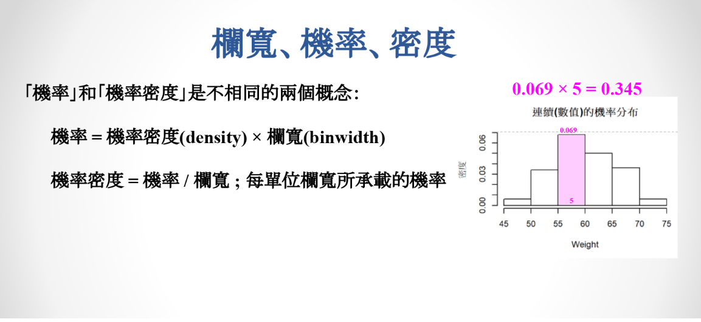
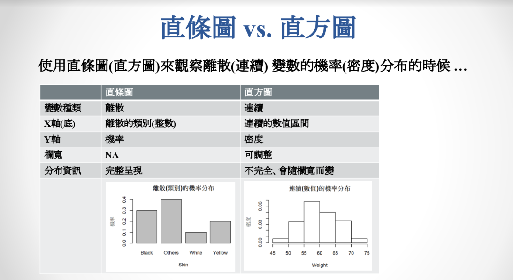
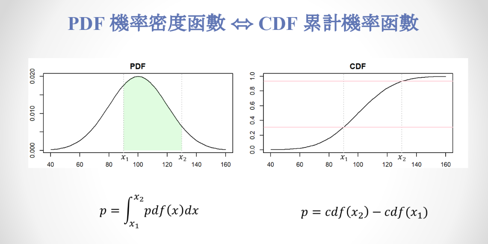
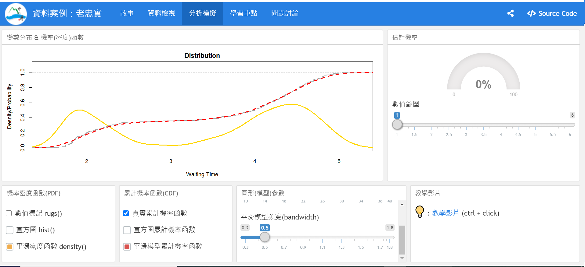
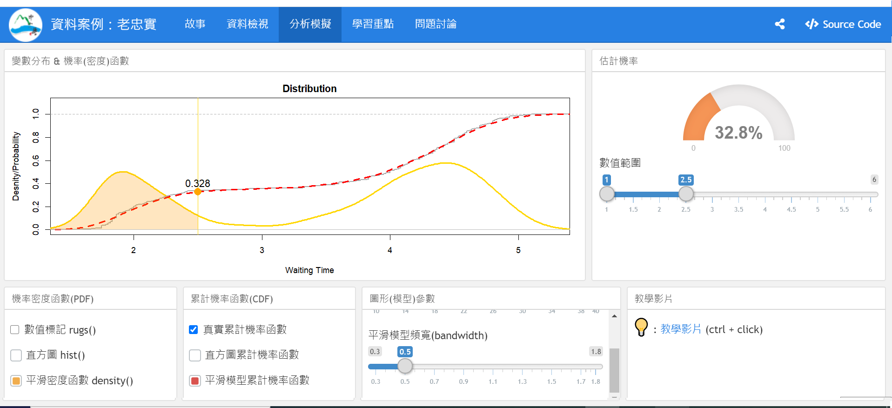
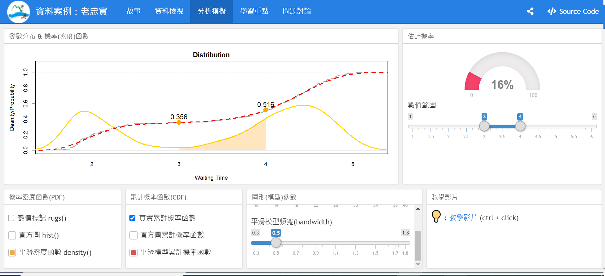
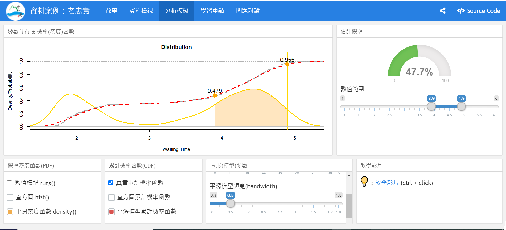

```{r results='hide', message=FALSE, warning=FALSE, echo=F}
# 這些程式碼設定網頁的格式，並安裝、載入一些基本的套件，請大家不要去改動<br>
rm(list=ls(all=T))
knitr::opts_chunk$set(comment = NA)
knitr::opts_knit$set(global.par = TRUE)
options(scipen=20, digits=5, width=80)
if(!require(pacman)) install.packages("pacman")
```
<hr>

```{r results='hide', message=FALSE, warning=FALSE}
pacman::p_load(magrittr)
```

### 【A】以向量為基礎的『實證』隨機變數

<span style="font-size:20px">`r "\U1F4A1"`</span>：
__隨機實驗__：重複進行時會出現不能完全預測的結果的實驗。<br>

<span style="font-size:20px">`r "\U1F4A1"`</span>：
__隨機變數__：定義在隨機實驗的結果之上的變數。<br><br>

__機率__：在一個不確定的重複實驗(Trials)之中，出現某一種結果(Event)的比率<br>
__隨機實驗__：結果不確定的實驗，像是抽很多不同顏色的球球，在r裡面常用向量代表<br>
__隨機變數__：在隨機實驗裡面的結果定義的變數，像是抽到紅球可以定義為'抽到紅球的機率'<br>
__分布__：隨機變數的各個可能出現的值，所出現的頻率<br>
  __值__：實驗中所有可能出現的值<br>
  __變數種類__：連續：身高之類、離散：整數，抽到的紅球個數<br>
  __分佈的形式__：數學函數 ⬄ 直條圖、直方圖、 (累計)機率密度函數<br>
  
  __類別__：沒有次序(顏色黃、綠、紅；尺寸大中小；教育程度高中低) ⬄ 直條圖<br>
  __數值__：任何實數都有可能出現(身高，可能是123.33；次數123456) ⬄ 直方圖<br>
  p.s.次數123456是數值，只是因為他不是連續的每個值都有，就是還是會有堅隔<br>
  
  __實證分布__：透過實際調查得到的<br>
  __理論分布__：普瓦松分布、常態分佈、二項分布(重複一成功機率為p的實驗n次，成功次數出現的分布)，或者是也可以用程式模擬分布<br>


##### 在向量上定義隨機變數
產生一個長度為10的類別向量(`SkinColor`)
```{r}
SkinColor = c("白","白","白","白","紅","紅","紅","黃","黃","黑")
```
向量本身並不是隨機變數，但是 ...<br>
<span style="font-size:20px">`r "\U1F4A1"`</span>：我們可以用
「從向量中隨機抽取一個值」這一個「隨機實驗」來定義一個「隨機變數」。<br><br>

##### 隨機抽樣
隨機抽出一個長度為20點的結果向量(`x`)
```{r}
#sample隨機抽樣的函數，前面放有哪些類別，size=20是抽二十次，每次跑都會是不一樣的x
x = sample(SkinColor, size=20, replace=T); x
```
<br>

##### 分佈：(隨機)變數的『值』所出現的『頻率』
分佈有兩種表示方式：頻率(次數)、比率(機率)
```{r  fig.width=8, fig.height=2}
#把剛剛抽的樣本畫出來
par(mfrow=c(1,2), mar=c(2,5,3,1), cex=0.8) #設定圖的大小
#算一下抽樣的樣本數量(不是抽樣結果)，有兩種寫法
table(SkinColor) %>% barplot(main='SkinColor,Freq') #寫成次數
table(SkinColor) %>% prop.table %>% barplot(main='SkinColor,Prop')#寫成比率
```
<br>

##### 結果向量的分佈
隨機抽樣會產生不同的結果，結果向量之中的分佈可能與原始向量不同
```{r fig.width=8, fig.height=2}
par(mfrow=c(1,4), mar=c(2,3,3,1), cex=0.75) #設定圖的大小

table(SkinColor) %>% prop.table %>% barplot(main='SkinColor') #原始樣本的分布
#每次做的事情都一樣，只是x1、x2、x3，分別代表第一二三次抽
table( sample(SkinColor,20,T) ) %>% prop.table %>% barplot(main='x1') 
table( sample(SkinColor,20,T) ) %>% prop.table %>% barplot(main='x2') 
table( sample(SkinColor,20,T) ) %>% prop.table %>% barplot(main='x3') 
```

<span style="font-size:20px">`r "\U1F4A1"`</span>：
結果向量的比率未必能直接代表原始族群的比率！<br><br>

```{r}
#接下來我們來抽很多次看看，下面印出來的分別是
#抽十次、一百次、一千次、一萬次、十萬次、一百萬次
#我們發現大概抽到一千次才會接近原始分布
set.seed(2)
sapply(1:6, function(n) {
  sample(SkinColor,10^n,T) %>% table %>% prop.table
  })
```

<span style="font-size:20px">`r "\U1F4A1"`</span>：
一開始我們設定的原始比率，各個顏色是4:3:2:1，但要大概到抽了一千次，才會接近原始的比率。所以我們知道，抽出來的比率要接近原始，需要有兩個條件：1.抽樣隨機、2.要抽一定次數以上次<br>

<span style="font-size:20px">`r "\U1F4A1"`</span>：
當抽樣的次數很大時，結果向量的比率會貼近原始族群的比率！<br>

<span style="font-size:20px">`r "\U1F4A1"`</span>：
從一個向量隨機抽樣時，我們可以以某個值(在向量之中)出現的比率，估計它會被抽到的機率。<br>

<span style="font-size:20px">`r "\U1F4A1"`</span>：
分布(Distribution)：用來描述或估計隨機變數的值會出現的機率或頻率。(各個不同的值會出現的比率)<br><br><hr>


### 【B】 隨機變數的分類

<span style="font-size:20px">`r "\U1F4A1"`</span>：隨機變數有三種常見的分類方式...

+ 離散 vs. 連續
+ 類別 vs. 數值
+ 實證 vs. 理論

<span style="font-size:20px">`r "\U1F5FF"`</span>：
常態分佈(Normal Dist.)所描述的是哪一類分佈？理論<br>

<span style="font-size:20px">`r "\U1F5FF"`</span>：
二項分佈(Binomial Dist.)所描述的是哪一類分佈？理論<br>

<span style="font-size:20px">`r "\U1F5FF"`</span>：
卜瓦松分佈(Poission Dist.)所描述的是哪一類分佈？理論<br>

<span style="font-size:20px">`r "\U1F5FF"`</span>：
請舉一個實證分布的例子 ... <br>

<span style="font-size:20px">`r "\U1F5FF"`</span>：
[線上問卷](https://forms.gle/C2kpgJjTF5HQhVcs9)<br><br>


##### 定義不同「種類」的隨機變數
從常態分佈產生一個長度為100的結果向量：`Weight` 
```{r}
#除了實證資料，R也可以從理論分布抽東西出來
#如果不set.seed(2)，每次抽的都會不一樣
#rnorm 抽一百個，平均數是60，標準差是5
set.seed(2)                         # set.seed for randomization
Weight = rnorm(100,mean=60,sd=5)    # 100 random samples
Weight
```
<br>

##### 連續變數的分佈
連續變數的分佈也分佈有三種表示方式：頻率(次數)、比率(機率)
```{r  fig.width=8, fig.height=2}
par(mfrow=c(1,3), mar=c(2,5,2,1), cex=0.7, bty='n') #設定畫圖

hist(Weight, main='Histogram, Freq') #用直方圖畫頻率
hist(Weight, main='Histogram, Density', freq=F) #用直方圖畫密度, freq=F是畫密度的意思

#所有曲線下的值要等於1
plot(density(Weight),main='Prob. Dist. Function (pdf)',ylim=c(0,0.08))
curve(dnorm(x,60,5),0,100,col='red',add=T)
```

這邊注意，第二章圖代表的是機率密度，不是機率。
機率密度是指，每單位欄寬所乘載的機率。
如果是連續型數值，算出來的分布就會是機率密度；
如果是類別行數值，算出來的就會是機率。

 

> 像是圖中就是在55-60之間，有0.069發生的機率，
> 所以發生的機率，應該是欄寬5*0.069=0.345。



<p class="wwl">
<span style="font-size:20px">`r "\U1F36D"` 注意：</span><br>
另外要注意，在數量很小時，直方圖的欄寬有時候會影響機率密度的判斷，可以用下面的程式碼試試看，所以我們用在連續密度的處理上，常會改用機率密度函數density()，他會像是很多不同平均值和標準差的常態分佈相加，不過他也有自己的困境，就是要調bandwidth(頻寬)，頻寬越小圖形會越陡峭。
</p class="wwl">


```{r}
#pacman::p_load(shiny)
#runExample("01_hello")
```




> 左邊這邊的圖，我們把機率從0積分到x1，變成右邊的累計機率函數
> 右邊可以稱做左邊分布的左尾機率。


把實證資料轉換成模型，再依據模型去估計特定事件的發生機率，可以參考Faith2a.Rmd。




直方圖和機率密度函數像是不同的兩個模型，我們知道了實證資料，但我們想知道在數學上應該要怎麼去表現他，我們發現平滑密度函數可以比較好的貼合真實資料，指示也是需要去調他的頻寬



> 上面這個圖的意思就是，在這個頻寬0.5的平滑機率密度函數的模型下
> 噴發時間小於2.5小時，會噴發的機率是32.8。


下一次噴發時間落在三小時和四小時之間?16%


<br><br>

##### 四種不同「種類」的隨機變數
其實隨機變數的「種類」不只兩種
```{r fig.width=8, fig.height=2}

par(mfrow=c(1,4), mar=c(2,3,3,1), cex=0.75) #設定畫圖大小
Color = rep(c('綠','黑','褐'), c(100,200,300)) # categorial, non-order

table(Color) %>% barplot(main="顏色")
Size = rep(c('大','中','小'), c(150,200,250))  # categorial, order
table(Size) %>% barplot(main="大小")
Freq = rpois(600,2.5)                   # numeric, discrete   
table(Freq) %>% barplot(main= "次數")
Weight = rnorm(600,50,15)               # numeric, contineous 
hist(Weight, main= "重量")
```
<br><br><hr>

<p class="wwl">
<span style="font-size:20px">`r "\U1F36D"` 練習：</span><br>
以下這一段簡單的程式碼就可以分別畫出「類別」與「數值」變數的「頻率(次數)」與「機率」分佈；你可以在雙引號之間補進正確的標題，如："類別變數的次數分布"、"頻率"、"機率"、"密度"等等，讓圖形更加完整，更能幫助同學們分辨這四種不同的分佈嗎？ 
</p class="wwl">

```{r fig.width=8, fig.height=2}
par(mfrow=c(1,4), mar=c(2,5,3,1), cex=0.75)
table(SkinColor) %>% barplot(main="類別的數量分布", ylab="頻率", xlab="SkinColor")
table(SkinColor) %>% prop.table %>% barplot(main="類別的機率分布", ylab="機率", xlab="SkinColor")
hist(Weight, main="數值的頻率(次數)分布", ylab="頻率(次數)")
hist(Weight, freq=F, main="數值的機率密度分布", ylab="機率密度")
```

注意類別變數只能畫直條圖(barplot)，不可以像右邊畫直方圖(hist)。


### <span style="font-size:22px">`r "\U1F5FF"` 問題討論：</span>  {data-height=250}
<p class="qiz">
【D.預測與決策】<br>
假設有一個賭局，你可以花30元選定一個連續60秒的時段，如果老忠實下一次的噴發時間落在你指定的區間，你就可以贏到100元；請你使用頻寬為`0.5`的平滑密度模型 ...<br>
&emsp;■ 決定要不要參加這個賭局<br>
&emsp;■ 如果你參加的話，你要把噴發時間設定在哪一個區間呢？<br>
&emsp;■ 你設在這個區間的話，參加這個賭局的期望值是？<br>
<br>
假如賭場老闆從零開始把每10秒鐘設為一個區間，每個區間的賭金是五塊錢 ...<br>
&emsp;■ 你要怎麼押注，才能獲得最高的期望值呢？<br>
&emsp;■ 你的賭金和期望值各是多少？<br>
<br>
將獲利的期望值和賭金的比值稱為「期望投資報酬率」 ...<br>
&emsp;■ 「最大期望投資報酬率」和「最大期望報酬」的投資策略是一樣的嗎？<br>
&emsp;■ 你認為哪一個策略目標比較好呢？ 為什麼？<br>
<br>
</p class="qiz">



我們來看第一小題<br>
我們找了一個看起來最有可能贏錢的區間，大概是3.9-4.9小時之間<br>
那他的期望值是 -30*100 + 47.7% = 47.7-30 =17.7<br>

。贏了 70 => 70*0.477 <br>
。輸了-30 => 30(1-0.477) <br>

p.s.期望值：每種事件機率的報償*發生的機率<br>

<br><br>


