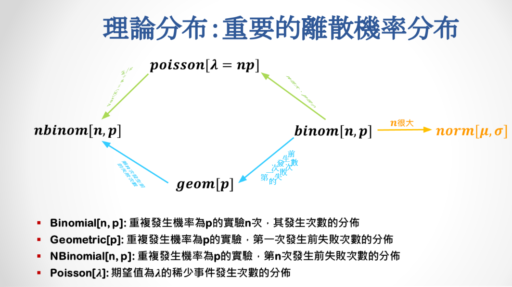

```{r results='hide', message=FALSE, warning=FALSE, echo=F}
# 這些程式碼設定網頁的格式，並安裝、載入一些基本的套件，請大家不要去改動<br>
rm(list=ls(all=T))
knitr::opts_chunk$set(comment = NA)
knitr::opts_knit$set(global.par = TRUE)
par(cex=0.8)
options(scipen=20, digits=5, width=80)
if(!require(pacman)) install.packages("pacman")
```
<hr>

```{r}
pacman::p_load(dplyr)
```


隨機變數：隨機實驗的結果，所會出現可能的比率叫做分布
> 隨機變數又可以分為離散和連續，離散出現的數值有限（類別、次數）只在特定的點出線機率（可用直方圖）
> 連續變數出現的值，因為有無限種可能，在每個點出現的機率都是零，所以我們要給定一個範圍，看機率密度是多少。
（即便無限小還是可以比大小）

## 重要的機率分布



### 【1】$n$很大時，二項分佈(Binominal Dist.)會趨近於常態(Normal)分佈

+ When $n$ is large, $Binom[n, p]$ approaches $Norm[\mu = n p, \sigma=\sqrt{n p (1-p)}]$ 

+ $X \sim Binom[n, p] \, \Rightarrow 
\, Exp(X) = n \cdot p \, , \, Var(X) = n \cdot p \cdot (1-p)$

```{r fig.height=2.4, fig.width=7.2}
par(mfrow=c(1,1), mar=c(3,4,3,1), cex=0.7)
n = 1000; p = 0.2
rbinom(500000, n, p) %>% hist(breaks=80, freq=F, main="")

#把紅色曲線畫出來
#dnorm是單點的機率分布，add=T代表圖要疊加
curve(dnorm(x, mean=n*p, sd=sqrt(n*p*(1-p))), col='red', lwd=2, add=T)
```

> 上面二項分布如果期望值大概是200，會發現期望值夠大，左右兩邊分布就會差不多

```{r fig.height=2.4, fig.width=7.2}
par(mfrow=c(1,2), cex=0.7)
n = 10; p = 0.2
rbinom(100000, n, p) %>% table %>% barplot() #二項分布
rnorm(100000, n*p, sqrt(n*p*(1-p))) %>% hist(freq=F) #常態分佈
```

<span style="font-size:24px">`r "\U1F4A1"`</span> :
當期望值夠大的時候， 二項分佈會以期望值為中心向兩邊對稱的伸展，但是如果期望值不夠大的話，這個分佈的左尾就會受到擠壓，變成一個不對稱的分佈。<br><br>

> 因為二項分布算實驗成功次數，最小就是0，會發現期望值不夠大，像左邊的圖左尾就被切掉了，可是如果用常態分佈去逼近(n可以小於0)，左尾就會出現

### 【2】$n \times p$不大時，二項分佈(Binominal Dist.)會趨近於Poisson分佈

+ When $n$ is large and $p$ is small, $Binom[n, p]$ approaches $Pois[\lambda = n p]$ 

```{r fig.height=2.4, fig.width=7.2}
par(mfrow=c(1,2), cex=0.7)
rbinom(100000, 1000, 0.002) %>% table %>% barplot(main="Boinomial")
rpois(100000, 2)  %>% table %>% barplot(main="Poisson")
```

<br><span style="font-size:24px">`r "\U1F5FF"`</span> :
如果Poisson分佈很接近二項分佈，我們為甚麼還需要Poisson分佈呢？<br><br>


### 【3】Poisson分佈的特性：(1)期望值等於標準差 & (2)期望值對加法有封閉性

+ $X \sim Pois[\lambda] \, \Rightarrow \, E(X) = Var(X) = \lambda$ 


```{r}
sapply(1:10, function(lambda) {
  x = rpois(1000000, lambda)
  c(mean(x), var(x))
  })
```

+ $X \sim Pois[\lambda_1], \, Y \sim Pois[\lambda_2] \, \Rightarrow \, X+Y \sim Pois[\lambda_1 + \lambda_2]$ 

> 一個λ1的Pois 1加上λ2的Pois 2，會等於一個Pois 3，λ3 = λ1 + λ2

```{r fig.height=2.4, fig.width=7.2}
par(mfrow=c(1,2), cex=0.7)

#rpois(100000, 1) 產生一個長度是10000，λ = 1 的poisson分布
(rpois(100000, 1) + rpois(100000, 2)) %>% table %>% barplot(main="Pois[1] + Pois[2]")
rpois(100000, 3)  %>% table %>% barplot(main="Pois[3]")
```

<br><br>

### 【4】Geometric Dist.基本上是等待時間的分佈
我們可以用二項分佈來模擬Geometric Dist.
```{r fig.height=2.4, fig.width=8}
par(mfrow=c(1,2), mar=c(3,3,3,1), cex=0.7)

#rbinom(100, 1, .3) 產生長度100，數值是0或1的向量
#二項分布，實驗1次，重複100次實驗，第1次成功之前失敗的次數分布（成功機率0.3）

#replicate找出第一次成功在哪裡，所以後面要-1
replicate(100000, which(rbinom(100, 1, .3) == 1)[1] - 1) %>% 
  table %>% barplot(main="Binomial Simulation")
rgeom(100000, 0.3) %>% table %>% barplot(main="Geometric")
```

<span style="font-size:24px">`r "\U1F5FF"`</span> :
如果有一台機器每一天壞掉的機率是0.05，那麼在20天之內，它還能正常工作的機率分別是多少呢？<br>

```{r}
#問的是從一天到第二十天就可以了

dgeom(1:20,0.05) %>% cumsum
#注意要從1開始，cumsum是累加的意思
```

<br>

### 【5】Geometric Dist.的期望值

+ $X \sim Geom[p] \, \Rightarrow \, E[X] = \frac{1}{p}-1$ <br>

<span style="font-size:24px">`r "\U1F5FF"`</span> :
如果平均而言每一個捐贈者有我需要的器官的機率是5%，那麼平均我要等多少個捐贈者才能等到我想要用的器官呢？<br>

```{r}
#答案是19
(1/0.05)-1
```

<span style="font-size:24px">`r "\U1F5FF"`</span> :
不用Geometric的期望值公式，妳可以使用`dgeom()`算出同樣的答案嗎？<br>
```{r}
#
sum(0:1000 * dgeom(0:1000,0.05))
```
<br><br><hr>

