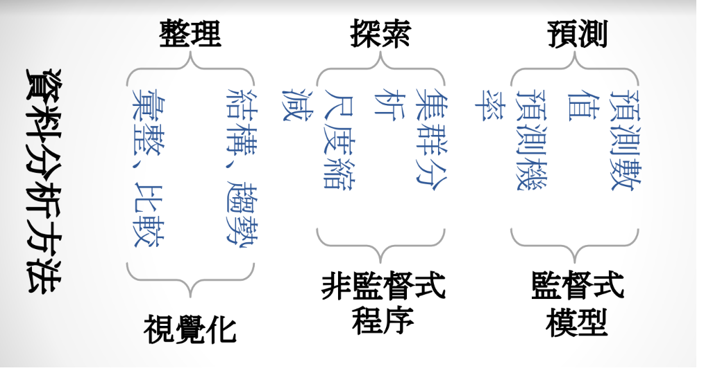

```{r results='hide', message=FALSE, warning=FALSE, echo=F}
# 這些程式碼設定網頁的格式，並安裝、載入一些基本的套件，請大家不要去改動<br>
rm(list=ls(all=T))
knitr::opts_chunk$set(comment = NA)
knitr::opts_knit$set(global.par = TRUE)
par(cex=0.8)
options(scipen=20, digits=5, width=80)
if(!require(FactoMineR)) install.packages("FactoMineR")
if(!require(factoextra)) install.packages("factoextra")
if(!require(MASS)) install.packages("MASS")
if(!require(dendextend)) install.packages("dendextend")
if(!require(pacman)) install.packages("pacman")
```
<hr>

```{r results='hide', message=FALSE, warning=FALSE}
pacman::p_load(dplyr, ggplot2, readr, FactoMineR, factoextra, dendextend)
# flexclust 
```
<br>

## 資料分析的三個步驟


。 多個尺度太多，可以壓縮成兩個尺度就好

### 【A】批發商資料集

```{r}
W = read.csv('data/wholesales.csv')
W$Channel = factor( paste0("Ch",W$Channel) )
W$Region = factor( paste0("Reg",W$Region) )
W[3:8] = lapply(W[3:8], log, base=10)
summary(W)
```
<br>

### 【B】層級式集群分析

<p class="wwl">
<span style="font-size:20px">`r "\U1F4A1"` 層級式集群分析的步驟：</span><br>
&emsp; ■ `scale()` : 標準化<br>
&emsp; ■ `dist()` : 距離矩陣<br>
&emsp; ■ `hclust()` : 層級式集群分析<br>
&emsp; ■ `plot()` : 畫出樹狀圖<br>
&emsp; ■ `rect.hclust()` : 依據dandrogram做切割<br>
&emsp; ■ `cutree()` : 產生分群向量<br>
</p class="wwl">

> 標準化：(每個數-平均值)/標準差，平均數會是0，標準差會是1
> 為了讓每個欄位的差異，對分群的影響會是一樣的(有些欄位的單位會不一樣)
> 不然尺度大的東西，可能會對分群的影響比較劇烈

為了方便解釋，我們先使用兩個區隔變數做**層級式集群分析**
```{r}
#Hierarchical c
#               標準化    距離矩陣    層級式集群分析
hc = W[,3:4] %>% scale %>% dist %>% hclust #產出的hc是一棵樹
```


**樹狀圖的判讀與切割**
```{r}
plot(hc)
#k=5要切多少群
k=5; rect.hclust(hc, k=5, border="red")
```

**產生分群向量**
```{r}
#加上一個新變數group，存分群向量
W$group = cutree(hc, k=5) %>% factor
```

```{r fig.width=5, fig.height=4.5}
#x是生鮮食品銷售量；y是牛奶銷售量
ggplot(W, aes(x=Fresh, y=Milk, col=group)) +
  geom_point(size=3, alpha=0.5)
```


### 【C】使用五個區隔變數做分群
```{r}
hc = W[,3:7] %>% scale %>% dist %>% hclust
plot(hc)
k = 6; rect.hclust(hc, k, border="red")
W$group = cutree(hc, k) %>% factor
```

```{r}
hc %>% as.dendrogram %>% color_branches(k) %>% color_labels(k,col='white') %>% plot
```


### 【D】尺度縮減

+ 主成分分析： `PCA()` - Principle Component Analysis

```{r fig.height=7, fig.width=8}

# names是改名稱
names(W)[3:8] = c('生鮮','奶製品','雜貨','冷凍','清潔用品','熟食')

# 主成分分析(多尺度會壓到低尺度，六個尺度壓到兩個)
W[,3:8] %>% PCA(graph=F) %>% fviz_pca_biplot(
  col.ind=W$group,  # 
  label="var", pointshape=19, mean.point=F,
  addEllipses=T, ellipse.level=0.7,
  ellipse.type = "convex", palette="ucscgb",
  repel=T
  )

# graph=F圖不等於黑白 #col.ind=W$group用分群向量當顏色(ind的意思是一個點)
# 線是每個尺度在壓縮空間上的方向
# (1)越相似的點越靠在一起(點和點之間的相似性)
# (2)越相關的變數會靠在一起(變數之間的相關性)
# (3)越外面的點買的越多，可以看到不同客群之間的特性(群之間的變數特性)
```
<br><br>

<p class="wwl">
<span style="font-size:20px">`r "\U1F4A1"` 學習重點：</span><br>
&emsp; ■ 集群分析的基本觀念<br>
&emsp; ■ 距離矩陣：Distance Matrix<br>
&emsp; ■ 層級式集群分析：Hierarchical Cluster Analysis<br>
&emsp; ■ 樹狀圖(Dendrogram)的判讀<br>
&emsp; ■ 依據樹狀圖決定要分多少群<br>
&emsp; ■ 集群分析與尺度縮減的綜合應用<br>
&emsp; ■ 現代化的資料視覺化工具套件<br>
</p class="wwl">

<br><br><br><hr>

