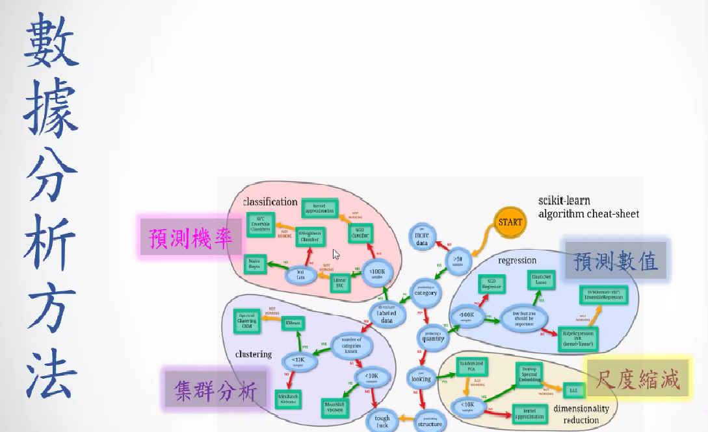

```{r results='hide', message=FALSE, warning=FALSE, echo=F}
# Formating Codes.  Do not change the codes in this chunk.<br>
rm(list=ls(all=T))
knitr::opts_chunk$set(comment = NA)
knitr::opts_knit$set(global.par = TRUE)
par(cex=0.8)
options(scipen=20, digits=5, width=80)
if(!require(pacman)) install.packages("pacman")
```
<hr>

```{r results='hide', message=FALSE, warning=FALSE}
pacman::p_load(dplyr, ggplot2, car, vcd, GGally, mvtnorm)
```
<br>


+ 舉例
視覺化之後可能決定要針對某商品行銷，
策略像是周年慶或是送獎品，戰術可能選定30歲以上的男性上班族





```{r}
md = 
```


### 【A】批發商資料集

```{r}
W = read.csv('data/wholesales.csv')
W$Channel = factor( paste0("Ch",W$Channel) )
W$Region = factor( paste0("Reg",W$Region) )
W[3:8] = lapply(W[3:8], log, base=10)
summary(W)
```
<br>

幾乎都是連續變數，只有兩個類別變數
Channel 通路
Region 地區

### 【B】連續變數的相關性(係數) Correlation

**B1a. 點狀圖 Simple Scatter Plot**
```{r fig.height=3.2, fig.width=3.2}
par(cex=0.7, mar=c(4,4,2,2))
plot(W$Milk, W$Grocery)
```

**B1b. 點狀圖+回歸線 Scatter Plot with Regrssion Line**
```{r fig.height=3.2, fig.width=3.2}
ggplot(W, aes(x=Milk, y=Grocery)) +
  geom_point(alpha=0.3) +
  geom_smooth(method="lm")
```

**B2. 回歸係數 Correlation**
$$r_{xy}=\frac{Cov(x,y)}{\sigma_x \sigma_y}
=\frac{\Sigma_{i=1}^n(x_i - \bar{x})(y_i - \bar{y})}
{\sqrt{\Sigma_{i=1}^n(x_i - \bar{x})^2} \sqrt{\Sigma_{i=1}^n(y_i - \bar{y})^2}}$$

```{r}
#牛奶售出額和雜貨售出額的相關性
cor(W$Milk, W$Grocery)
```


**B3. 回歸係數檢定 Correlation Test**
```{r}
# 相關性算出來一定會有一個數值，那要看顯不顯著會取決於資料的變異數大小
# 可以用cor.test看看顯著不顯著
# p-value 小於0.05是顯著
cor.test(W$Milk, W$Grocery)

```

p值如果是0.1，代表如果兩個變數真的沒有關係，那看到他們兩個有關係的機率就是0.1。

<span style="font-size:20px">`r "\U1F4A1"` ： </span>
$p-value$: 給定虛無假設($H_0:r=0$)，檢定統計量($t$)大於觀察值($24.4$)的機率

<span style="font-size:20px">`r "\U1F5FF"` ： </span>
當$p = 0.05$時，對立假設($H_A$)為真的機率是？

<span style="font-size:20px">`r "\U1F4A1"` ： </span>
貝氏定理：$P(A|B) = P(B|A) \cdot P(A) / P(B)$
<br>

**B4. Simulating Bi-Variate Normal Distibution**
```{r  fig.height=6, fig.width=6}
par(cex=0.7, mar=c(1,1,1,1), mfrow=c(3,3))
for(r in seq(-1,1,0.25)) {
  mu = c(0,0)
  sigma = matrix(c(1,r,r,1),nrow=2)   # covariance matrix 
  rmvnorm(500, mu, sigma) %>% plot(col='gray') #隨機產生500點相關性不同的數據
  text(0,0,r,cex=3,col='blue',font=2)
  }
```
<br><hr>

### 【C】相關性矩陣

**C1. Matrix of Correlation Coefficients**
```{r}
cor(W[,3:8]) %>% round(3)
```

<span style="font-size:20px">`r "\U1F4A1"` ： </span>
相關性矩陣：(a)對角線等於1；(b)左下、右上對稱

**C1. Matrix of Scatter Plots**
```{r fig.height=8, fig.width=8}
#car套件裡面的函數scatterplotMatrix
car::scatterplotMatrix(W[,3:8])
```
<br><hr>

### 【D】類別變數之間的關聯性 Association

**D1. 關聯性卡方檢定 Chisq-Test for Association**
```{r}
table(W$Channel, W$Region) %>% chisq.test()
```

+ The association between `Channel` and `Region` is not significant
+ I.e., The distribution of `Channel` does not depends on `Region` and vice versa.

**D2. 馬賽克圖 Mosaic Plot**
```{r}
library(vcd)
structable(Channel ~ Region, W) %>% 
  mosaic(shade=T, labeling=labeling_residuals)

#都沒有顏色的話，代表這兩個類別變數沒有甚麼關聯性
```

**D3. Another Example**
```{r}
#列連表
#裡面的數量是擁有兩個類別的數量
haireye <- margin.table(HairEyeColor, 1:2)
haireye
```

頭髮顏色的邊際機率
```{r}
#在不管眼珠顏色的時候，頭髮顏色的機率
(mpHair = rowSums(haireye)/sum(haireye)) # marginal prob.
```

眼睛顏色的邊際機率
```{r}
#在不管頭髮顏色的時候，眼睛顏色的機率
(mpEye = colSums(haireye)/sum(haireye)) # marginal prob.
```

**若頭髮、眼睛顏色是不相關的(Independent)**，則頭髮、眼睛的**聯合機率分佈**為
```{r}
(expProb = mpHair %o% mpEye)
```

```{r}
sum(expProb)
```

**若頭髮、眼睛顏色是不相關的(Independent)**，則各頭髮、眼睛組合的期望值是
```{r}
(expVal = expProb * sum(haireye))
```

**標準化殘差(Standardized Residual)** 
```{r}
(s.res = (haireye - expVal) / sqrt(expVal))
```

**馬賽克圖** 
```{r}
#藍色表示說顯著高於期望值
#像是左下角的意思是說金色頭髮宗色眼睛的人明顯比平均值多
#黑色頭髮裡面有棕色眼睛的人顯著高於平均，藍色眼睛顯著小於平均
mosaic(haireye, shade=T, labeling=labeling_residuals)
```
所有藍色眼珠的人中，有黑色頭髮的比率是顯著低於平均，而有金色頭髮的比率是顯著高於平均。棕色與紅色頭髮則沒有顯著高或低於平均

<p class="wwl">
<span style="font-size:20px">`r "\U1F4A1"` 學習重點：</span><br>
&emsp; ■ The Association between `Hair` and `Eye` is significant<br>
&emsp; ■ For Black-Hair:<br>
&emsp; &emsp; ■ the propotion of Brown-Eye is significantly higher than `the expected`<br>
&emsp; &emsp; ■ the propotion of Blue-Eye is significantly lower<br>
&emsp; ■ For Red-Hair:<br>
&emsp; &emsp; ■ he propotion of Green-Eye is significantly higher<br>
&emsp; ■ For Blond-Hair:<br>
&emsp; &emsp; ■ the propotion of Brown-Eye is significantly lower<br>
&emsp; &emsp; ■ the propotion of Blue-Eye is significantly higher<br>
&emsp; &emsp; ■ the propotion of Hazel-Eye is significantly lower<br>
</p class="wwl"><br>


**D4. The `Expected Value` in Contingent Table**
```{r}
( expected = independence_table(haireye) )
```

It is derived from the marginal probability in both directions
```{r}
(rowSums(haireye) %o% colSums(haireye)) / sum(haireye)
```

**D5. Residuals**
```{r}
( residuals = haireye - expected ) 
```

**D6. Standardized Residuals**
```{r}
( std.residuals = residuals / sqrt(expected)  ) 
```

<br>
<span style="font-size:20px">`r "\U1F9D9"`</span>
熱圖與馬賽克圖的比較 [Heatmap.Rmd](http://140.117.69.135:4949/tonychuo/Heatmap.Rmd)

<br><hr>

### 【E】類別與連續變數之間的關係 - GGally
```{r fig.height=9, fig.width=9}
library(GGally)
ggpairs(iris, aes(colour = Species, alpha=0.4),
        lower=list(combo = wrap("facethist", binwidth = 0.2)))
```

不同的顏色是不同的種類
左下角點點的散佈圖的數值是對應到右上角的相關係數
黑色的數值是如果沒有分群去看，他的相關性數值

### 【F】類別與連續變數的各種可能關係圖示

##### F1. 單一類別變數
```{r fig.height=2.5}
par(cex=0.8, mar=c(2,3,1,1), mfrow=c(1,1))
table(W$Channel) %>% barplot
```

##### F2. 單一連續變數
```{r fig.height=3, fig.width=6.4}
par(cex=0.8, mar=c(4,3,1,1))
hist(W$Fresh)
```

##### F3. 兩類別變數
```{r}
structable(Channel ~ Region, W) %>% 
  mosaic(shade=T, labeling=labeling_residuals)
```
<span style="font-size:20px">`r "\U1F4A1"` ： </span>
如果類別變數裡面有太多分類(或各分類的數量很不平衡)，我們應該考慮使用熱圖<br>

##### F4. 類別 X 數量
類別和數量變數擺在一起，就可以做分類統計
```{r}
tapply(W$Milk, W$Region, sum)
```

**分類平均**
```{r}
tapply(W$Milk, list(W$Channel, W$Region), mean)
```

**分類總和**
```{r}
tapply(W$Milk, list(W$Channel, W$Region), sum)
```

另一種做法
```{r}
xtabs(Milk ~ Channel + Region, data=W)
```

```{r}
ggplot(W, aes(x=log(Milk))) +
  geom_histogram(aes(fill=Region), alpha=0.5, bins=20) +
  facet_grid(Channel~Region) +
  labs(title="Distribtion of Sales of Milk")
```

```{r fig.height=2.5, fig.width=7.5}
ggplot(W, aes(x=log(Milk))) +
  geom_density(aes(fill=Region), alpha=0.5) +  # compare the density of Region 
  facet_grid(~Channel) +                       # by Channel
  labs(title="Density of Sales of Milk")
```

```{r fig.height=2.5, fig.width=7.5}
ggplot(W, aes(x=log(Milk))) +
  geom_density(aes(fill=Channel), alpha=0.5) +  # compare the density of Channel
  facet_grid(~Region) +                         # by Region 
  labs(title="Density of Sales of Milk")
```


##### F5. 數量 X 數量 (X 類別)
```{r fig.height=4, fig.width=4}
ggplot(W, aes(x=log(Milk), y=log(Fresh))) +
  geom_point() +
  stat_smooth(method="lm",se=F)
```


```{r fig.height=3, fig.width=6}
ggplot(W, aes(x=log(Milk), y=log(Fresh))) +
  geom_point() +
  stat_smooth(method="lm", se=F) +
  facet_grid(~Region)
```

```{r fig.width=6}
ggplot(W, aes(x=log(Milk), y=log(Fresh))) +
  geom_point() +
  stat_smooth(method="lm", se=F, col='red') +
  facet_grid(Channel~Region)
```

<br>
<span style="font-size:20px">`r "\U1F4A1"` 學習重點：</span>
存在整個族群的關係和個別分群之中的關係有可能是不同(甚至是相反)的！

```{r}
load("../olist/data/olist.rdata")

P2 = group_by(R, order_id) %>% 
  summarise(score = mean(review_score)) %>% 
  right_join(O) %>% select(order_id, score) %>% 
  right_join(I) %>% group_by(product_id) %>% 
  summarise(score = mean(score)) %>% 
  right_join(P) %>% left_join(TPC) %>% 
  rename(category = product_category_name_english)
```

```{r}
cor.test(P2$score, P2$product_photos_qty, use="complete.obs")
```

```{r}
K = 40
topK = table(P2$category) %>% sort %>% tail(K) %>% names
PK = filter(P2, category %in% topK)
par(cex=0.6, mar=c(4,20,4,2))
split(PK, PK$category) %>% 
  sapply(function(df) {
    cor(df$score, df$product_photos_qty, use="complete.obs")
  }) %>% sort %>% 
  barplot(horiz=T, las=2, main=sprintf(
    "Cor(Rev.Score, Photo.Qty), Top%d", K))
abline(v=seq(-0.1, 0.1, 0.05), col="red", lty=2)
```


<br><br><br><hr>


