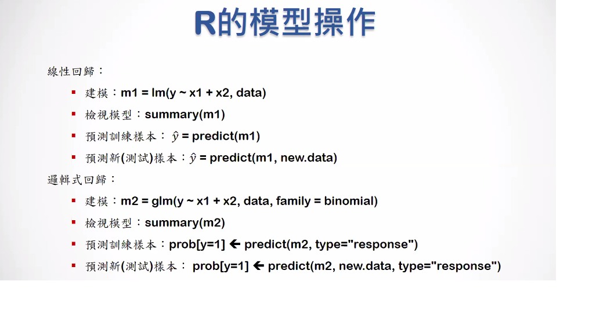
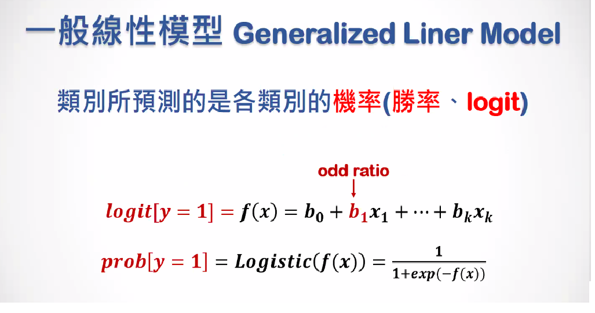
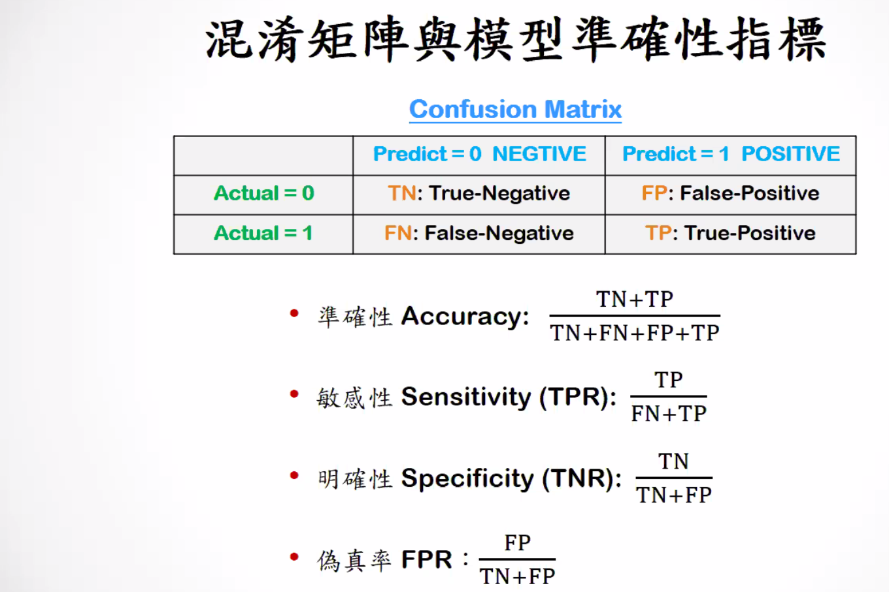
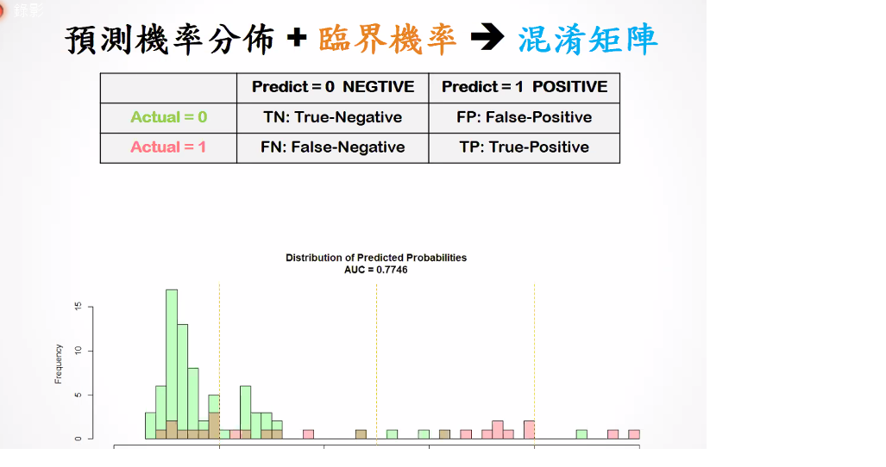
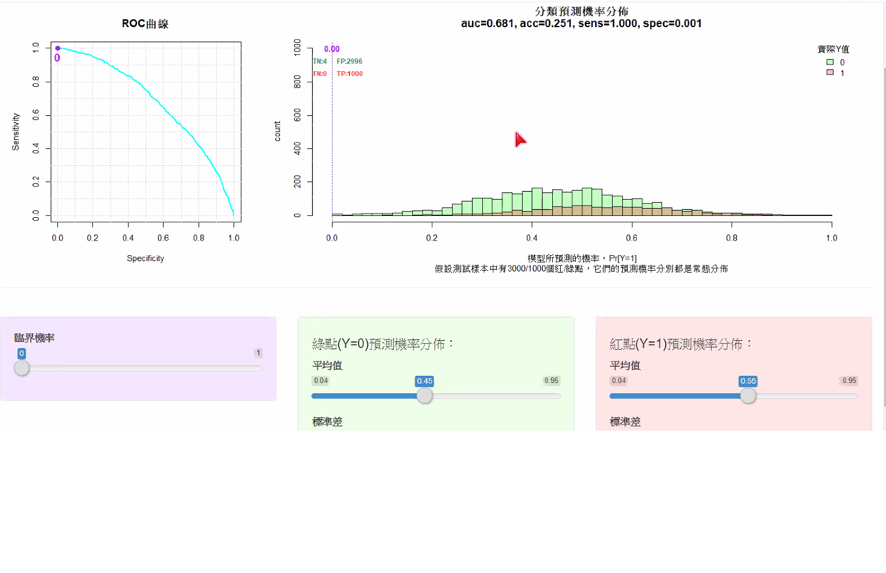
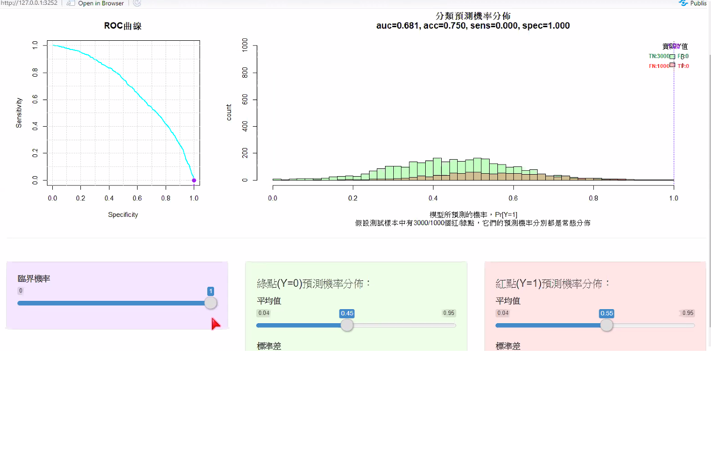
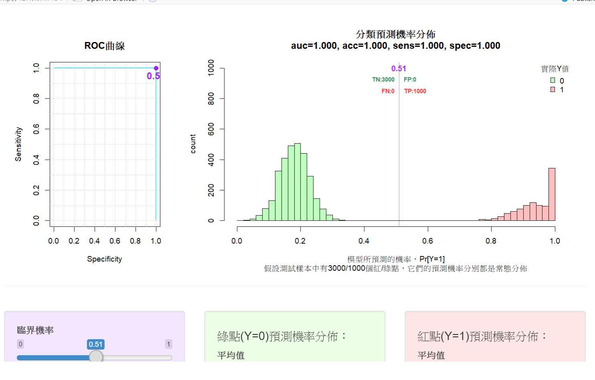
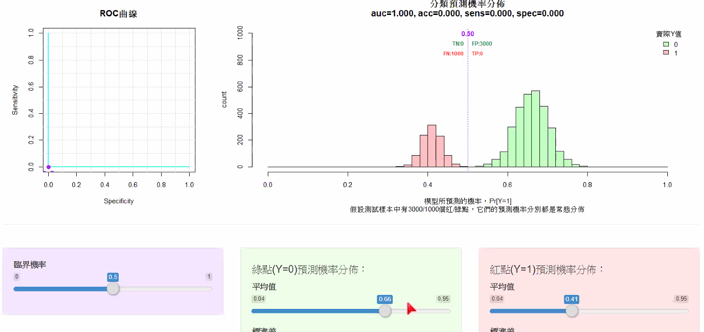
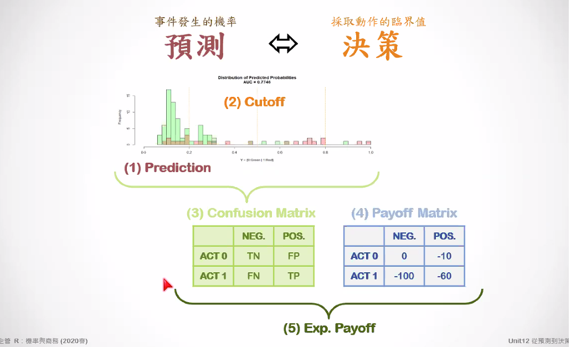
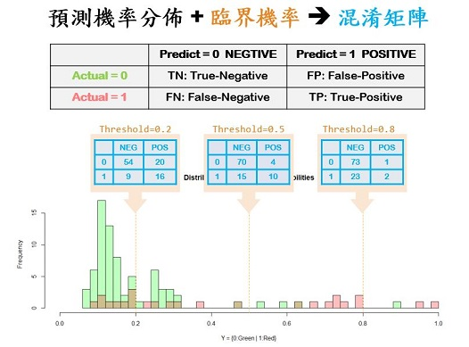

```{r results='hide', message=FALSE, warning=FALSE, echo=F}
# Formating Codes.  Do not change the codes in this chunk !!
rm(list=ls(all=T))
knitr::opts_chunk$set(comment = NA)
knitr::opts_knit$set(global.par = TRUE)
par(cex=0.8)
options(scipen=20, digits=5, width=80)
if(!require(pacman)) install.packages("pacman")
```
<hr>


邏輯式回歸回傳的是二元分類後的機率
一般的線性回歸回傳的是y可能的值，和二元沒有關係





通常混淆矩陣需要搭配一個臨界值，像是機率大於0.5的時候就猜是1之類的。

敏感性是真的有也檢測出來的，
明確性是真的沒有也有檢測出來的。



【???】
這裡每一個點都有被預測是紅色或是綠色的機率畫成的長條圖。
t = 0.8的意思是t=0.8右邊的值我們都猜是紅色的1
但是會有1個綠色是猜錯的。



臨界機率是0，我們猜所有的值都是1，這時候敏感值會是1，明確性會是0




當綠色點點和紅色點點都分得很開，t值剛剛好在兩群中間，讓她分得很好的畫，就可以讓明確值、敏感度、還有accuracy都是1。

accuracy比較像是辨識率，就是兩群數值可以被模型分開的比率。



黃色這個是不可能的，因為auc不可能小於0.5。


模型如果做這樣，只要把1和0相反過來就好了，這裡我們可以知道，用auc來當指標會比較好，不會受到臨界值t的影響，acc只要把模型可以分開都會很高。

通常我們需要求一個auc最大的模型，然後再去調他的臨界值。



圖上面的文字就是t的值

# 1
第一題我們希望找到那群最嚴重的那群人是誰(y=1)，那我們可以盡量找roc上面可以讓y值比較小的t，像是0.8或0.9之類的。

#詳解 可以選0.7
希望用一點點的false positive 的增加，換到很多true positive的值得畫，就可以算是好的值，0.7-0.3都是好的。

0.3或0.4都是還不錯的，0.2的話就有點太多了。

從上面的例子我們可以發現，如果猜錯或猜對付出的代價改變之後，那我們的t值可能就要跟著改變。


**案例：糖尿病患醫療品質**
```{r results='hide', message=FALSE, warning=FALSE}
pacman::p_load(caTools, ggplot2, dplyr)
D = read.csv("data/quality.csv")  # Read in dataset
set.seed(88)
split = sample.split(D$PoorCare, SplitRatio = 0.75)  # split vector
TR = subset(D, split == TRUE)
TS = subset(D, split == FALSE)
glm1 = glm(PoorCare ~ OfficeVisits + Narcotics, TR, family=binomial)
summary(glm1)

# 第二個模型
# 為甚麼有些變數的顯著性和模型一步一樣
glm_all = glm(PoorCare ~ . -MemberID , TR, family=binomial)
summary(glm_all)
```
<br><hr>


### 【A】傳統準確性指標


<br>

##### Training Data

**預測機率 Predicted Probability (Training)**
```{r fig.height=3.2, fig.width=6.4}
par(cex=0.8)
#如果不加type="response"就會回傳0和1，然後機率設為0.5
pred = predict(glm1, type="response")
hist(pred)
abline(v=0.5, col='red')

#第二個模型 #TRAIN
pred_all_TR = predict(glm_all,TR, type="response")
hist(pred_all_TR)
abline(v=0.5, col='red')

#第二個模型 #TEST
pred_all_TS = predict(glm_all,TS, type="response")
hist(pred_all_TS)
abline(v=0.5, col='red')
```

**混淆矩陣 Confusion Matrix (Training)**
```{r}
cmx = table(Acture=TR$PoorCare, Predict=pred > 0.5)
cmx

#第二個模型
#train
cmx_all_TR = table(Acture=TR$PoorCare, Predict=pred_all_TR > 0.5)
cmx_all_TR

#test
cmx_all_TS = table(Acture=TS$PoorCare, Predict=pred_all_TS > 0.5)
cmx_all_TS
```

**模型準確性指標 Accuracy Metrices (Training)**
```{r}
# x是混淆矩陣，會算出
# k是取小數點後三位
Accuracy = function(x, k=3) c(
  accuracy = sum(diag(x))/sum(x),
  sensitivity = as.numeric(x[2,2]/rowSums(x)[2]),
  specificity = as.numeric(x[1,1]/rowSums(x)[1])
  ) %>% round(k)

Accuracy(cmx)
Accuracy(cmx_all_TR)
Accuracy(cmx_all_TS)
```
<br>

##### Testing Data

**預測機率 Predicted Probability (Testing)**
```{r fig.height=3.2, fig.width=6.4}
par(cex=0.8)
# pred2是一個向量
pred2 = predict(glm1, newdata=TS, type="response")
hist(pred2, 10)
abline(v=0.5, col='red')
```

**混淆矩陣 Confusion Matrix (Testing)**
```{r}
cmx2 = table(Acture=TS$PoorCare, Predict=pred2 > 0.5)
cmx2
```

**模型準確性指標 Accuracy Matrices (Testing)**
```{r}
#前面list裡面的所有元件，都套用到Accuracy這個函式裡面
sapply(list(Train=cmx, Test=cmx2), Accuracy)
sapply(list(Train=cmx_all_TR, Test=cmx_all_TS), Accuracy)
```
<br><br><hr>

### 【B】預測機率分佈、臨界機率、混淆矩陣



<br>

**預測機率分佈 (DPP) - Distribution of Predicted Probability (Train)**
```{r fig.height=3.2, fig.width=7}

# TR$PoorCare變成類別變數
data.frame(y=factor(TR$PoorCare), pred=pred) %>% 
  
  # x是預測值，y是實際的
  ggplot(aes(x=pred, fill=y)) +  
  geom_histogram(bins=20, col='white', position="stack", alpha=0.5) +
  ggtitle("Distribution of Predicted Probability (DPP,Train)") +
  xlab("predicted probability")
```
<br>

**預測機率分佈 (DPP) - Distribution of Predicted Probability (Test)**
```{r fig.height=3.2, fig.width=7}
# TR$PoorCare變成類別變數
data.frame(y=factor(TR$PoorCare), pred=pred_all_TR) %>% 
  
  # x是預測值，y是實際的
  ggplot(aes(x=pred_all_TR, fill=y)) +  
  geom_histogram(bins=20, col='white', position="stack", alpha=0.5) +
  ggtitle("Distribution of Predicted Probability (DPP,Train)") +
  xlab("predicted probability")


# TR$PoorCare變成類別變數
data.frame(y=factor(TS$PoorCare), pred=pred_all_TS) %>% 
  
  # x是預測值，y是實際的
  ggplot(aes(x=pred_all_TS, fill=y)) +  
  geom_histogram(bins=20, col='white', position="stack", alpha=0.5) +
  ggtitle("Distribution of Predicted Probability (DPP,Test)") +
  xlab("predicted probability")
```

<br><br><br><hr>

### 【C】作業曲線(ROC)與辨識率(AUC)

**ROC - Receiver Operation Curve**
```{r fig.height=4, fig.width=7.2}
par(mfrow=c(1,2), cex=0.8)

# plotROC=T 是用來畫圖
trAUC = colAUC(pred, y=TR$PoorCare, plotROC=T) #train
tsAUC = colAUC(pred2, y=TS$PoorCare, plotROC=T) #test

trAUC_all = colAUC(pred_all_TR, y=TR$PoorCare, plotROC=T) #train
tsAUC_all = colAUC(pred_all_TS, y=TS$PoorCare, plotROC=T) #test
```

**AUC - Area Under Curve**
```{r}
c(trAUC, tsAUC)
c(trAUC_all, tsAUC_all)

```
<br><hr>

<p class="qiz">
<span style="font-size:24px">`r "\U1F5FF"` 練習： </span><br>
使用`TR$MemberID`以外的所有欄位，建立一個邏輯式回歸模型來預測`PoorCare`，並：<br>
&emsp; 【A】 分別畫出`Training`和`Testing`的`DPP`<br>
&emsp; 【B】 分別畫出`Training`和`Testing`的`ROC`<br>
&emsp; 【C】 分別算出`Training`和`Testing`的`ACC`、`SENS`和`SPEC`<br>
&emsp; 【D】 分別算出`Training`和`Testing`的`AUC`<br>
&emsp; 【E】 跟用兩個預測變數的模型相比，這一個模型有比較準嗎？<br>
&emsp; 【F】 為什麼它比較準(或比較不準)呢？<br><br>
</p class="qiz">

【A】
```{r}
# TR$PoorCare變成類別變數
data.frame(y=factor(TR$PoorCare), pred=pred_all_TR) %>% 
  
  # x是預測值，y是實際的
  ggplot(aes(x=pred_all_TR, fill=y)) +  
  geom_histogram(bins=20, col='white', position="stack", alpha=0.5) +
  ggtitle("Distribution of Predicted Probability (DPP,Train)") +
  xlab("predicted probability")


# TR$PoorCare變成類別變數
data.frame(y=factor(TS$PoorCare), pred=pred_all_TS) %>% 
  
  # x是預測值，y是實際的
  ggplot(aes(x=pred_all_TS, fill=y)) +  
  geom_histogram(bins=20, col='white', position="stack", alpha=0.5) +
  ggtitle("Distribution of Predicted Probability (DPP,Test)") +
  xlab("predicted probability")
```


【B】
```{r}
par(mfrow=c(1,2), cex=0.8)
trAUC_all = colAUC(pred_all_TR, y=TR$PoorCare, plotROC=T) #train
tsAUC_all = colAUC(pred_all_TS, y=TS$PoorCare, plotROC=T) #test
```

【C】
  Train  Test
accuracy    0.798 0.844
sensitivity 0.440 0.500
specificity 0.919 0.958

【D】
 Train  Test
 0.87568 0.86458

【E】
從AUC的數值來看，用比較多變數的模型有比較準

(但是AIC的數值第一個模型比較小應該要比較好???)
AIC是TS準確度的預測
AUC適用在TR的評估
所以看哪個模型比較準應該要看AUC
(可以看看的資料：https://qastack.cn/stats/51275/what-is-the-difference-in-what-aic-and-c-statistic-auc-actually-measure-for-mo)

【F】
可能因為涵蓋更多其他有相關性的變數，讓線性模型考慮的較為細膩。

<br><br><br><hr>
