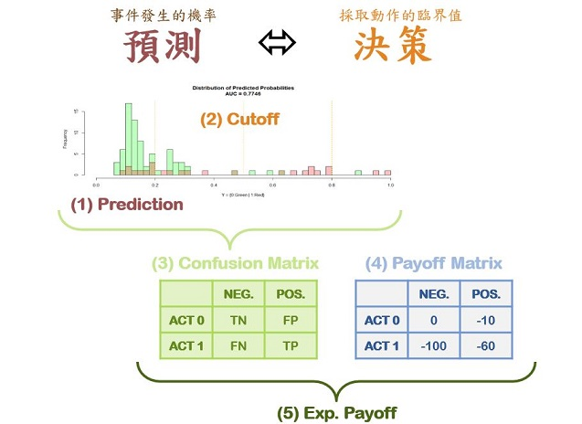

```{r results='hide', message=FALSE, warning=FALSE, echo=F}
# Formating Codes.  Do not change the codes in this chunk !!
rm(list=ls(all=T))
knitr::opts_chunk$set(comment = NA)
knitr::opts_knit$set(global.par = TRUE)
par(cex=0.8)
options(scipen=20, digits=5, width=80)
if(!require(pacman)) install.packages("pacman")
```
<hr>

```{r results='hide', message=FALSE, warning=FALSE}
pacman::p_load(caTools, ggplot2, dplyr)
D = read.csv("data/quality.csv")  # Read in dataset
set.seed(88)
split = sample.split(D$PoorCare, SplitRatio = 0.75)  # split vector
TR = subset(D, split == TRUE)
TS = subset(D, split == FALSE)
glm1 = glm(PoorCare ~ OfficeVisits + Narcotics, TR, family=binomial)
summary(glm1)
```
<br><hr>

### 【A】從預測到決策



<br><hr>

### 【B】預測機率分佈 (DPP)
因為這個資料集很小，我們使用全部的資料來做模擬 (通常我們是使用測試資料集)
```{r fig.height=3.2, fig.width=7}
pred = predict(glm1, D, type="response")
y = D$PoorCare
data.frame(pred, y) %>% 
  ggplot(aes(x=pred, fill=factor(y))) + 
  geom_histogram(bins=20, col='white', position="stack", alpha=0.5) +
  ggtitle("Distribution of Predicted Probability (DPP,FULL)") +
  xlab("predicted probability")
```
<br><hr>

### 【C】試算期望報酬

**報酬矩陣 Payoff Matrix**

+ TN: NoAction, GoodCare; 沒事   
+ FN: NoAction, PoorCare; 風險成本很高 
+ FP: Action, GoodCare;   預防成本
+ TP: Action, PoorCare;   預防成本 + 降低後的風險成本

```{r}
#先寫一個混淆矩陣
payoff = matrix(c(0,-100,-10,-50),2,2)
rownames(payoff) = c("FALSE","TRUE")
colnames(payoff) = c("NoAct","Act")
payoff
```


**期望報酬 Expected Payoff**
```{r fig.height=3.2, fig.width=7}

#t值從0到1，每0.1切開一次
cutoff = seq(0, 1, 0.01)

#算出報酬
result = sapply(cutoff, function(p) {
  cm = table(factor(y==1, c(F,T)), factor(pred>p, c(F,T))) 
  sum(cm * payoff) # sum of confusion * payoff matrix
  })
i = which.max(result)

# 把cutoff的結果畫出來
par(cex=0.7, mar=c(4,4,3,1))
plot(cutoff, result, type='l', col='cyan', lwd=2, main=sprintf(
  "Optomal Expected Result: $%d @ %.2f",result[i],cutoff[i]))

abline(v=seq(0,1,0.1),h=seq(-6000,0,100),col='lightgray',lty=3) #畫虛線
points(cutoff[i], result[i], pch=20, col='red', cex=2)
```

上面算出來的最佳期望報酬是-2360，因為希望降低風險成本，所以這個值是風險的最小值。如果t值是0，所有人都做，風險成本會大概是-2600，如果t值是1，所有人都不做，風險值就會是-3300。

我們可以發現其實商業情境之下，通常是需要對一部份的人做你的報酬會最好。

<br><hr>

### 【D】策略模擬

**使用`manipulate`套件做策略模擬**
```{r eval=F}
library(manipulate)
manipulate({
  payoff = matrix(c(TN,FN,FP,TP),2,2)
  cutoff = seq(0, 1, 0.01)
  result = sapply(cutoff, function(p) {
    cm = table(factor(y==1, c(F,T)), factor(pred>p, c(F,T))) 
    sum(cm * payoff) # sum of confusion * payoff matrix
    })
  i = which.max(result)
  par(cex=0.7)
  plot(cutoff, result, type='l', col='cyan', lwd=2, main=sprintf(
    "Optomal Expected Result: $%d @ %.2f",result[i],cutoff[i]))
  abline(v=seq(0,1,0.1),h=seq(-10000,0,100),col='lightgray',lty=3)
  points(cutoff[i], result[i], pch=20, col='red', cex=2)
  },
  TN = slider(-100,0,   0,step=5),
  FN = slider(-100,0,-100,step=5),
  FP = slider(-100,0, -10,step=5),
  TP = slider(-100,0, -50,step=5)
  ) 
```
<br>

<p class="qiz">
<span style="font-size:24px">`r "\U1F5FF"` 練習： </span><br>
執行`Sim12.R`，先依預設的報酬矩陣回答下列問題：<br>
&emsp; 【A】 最佳臨界機率是？ 它所對應的期望報酬是多少？<br>
&emsp; 【B】 什麼都不做時，臨界機率和期望報酬各是多少？<br>
&emsp; 【C】 每位保戶都做時，臨界機率和期望報酬各是多少？<br>
&emsp; 【D】 以上哪一種做法期的望報酬比較高？<br>
&emsp; 【E】 在所有的商務情境都是這種狀況嗎？<br><br>
藉由調整報酬矩陣：<br>
&emsp; 【F】 模擬出「全不做」比「全做」還要好的狀況<br>
&emsp; 【G】 並舉出一個會發生這種狀況的商務情境<br><br>
有五種成本分別為`$5, $10, $15, $20, $30`的介入方法，它們分別可以將風險成本從`$100`降低到`$70, $60, $50, $40, $25` ...<br>
&emsp; 【H】 它們的最佳期望報酬分別是多少？<br>
&emsp; 【I】 哪一種介入方法的最佳期望報酬是最大的呢？<br><br>
</p class="qiz">

【A】
最佳臨界機率：0.16；期望報酬：-2360

【B】
臨界機率：0.99；期望報酬：-3300

【C】
臨界機率：0；期望報酬：-2630

【D】
在最佳臨界機率的時候賠得最少

【E】
就是做的時候代價很高昂
或者是模型下意識會把大家都判斷的很嚴重(誤判率很高)
FP很高(本來沒有被判斷有)，FN很高(本來有被判斷沒有)
例子：TN=0；FN=-30；FP=-10；TP=-50

【F】
成本30的介入方法最佳期望報酬最大
其他成本的最佳t值與期望報酬如下。

$5
0.16；-2830

$10, 
0.36；-2830

$15, 
0.36；-2775

$20, 
0.36；-2720

$30`
0.36；-2700

<br><br><br><hr>
